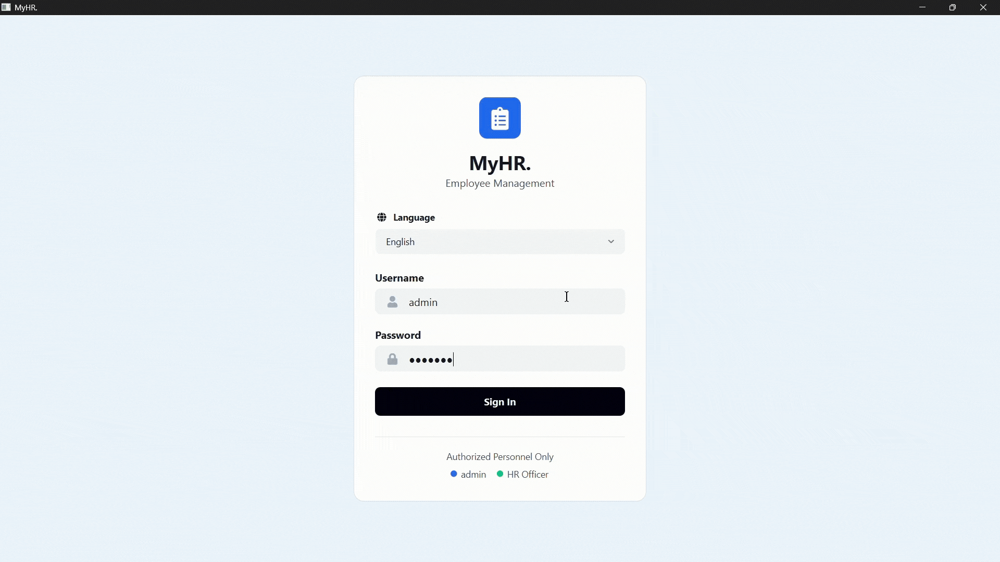

# MyHR -  Employee Management System


A standalone, offline desktop application for managing employee records, organizational hierarchy, promotions, commendations, and sanctions in government like organizations.


 <br/>


<p align="center">
  
</p>

---

**Supervisor:** Dr. Husam Al-Magsoosi   
**Developer:** Muhammad Ibrahim Shoeb   
**Institution:** Budapest University of Technology and Economics   
**Status:** Project Lab finished. Thesis part starts from this checkpoint.

---

## Tech Stack

| Layer | Technology |
|---|---|
| Language | Python 3.12+ |
| UI Framework | PySide6 6.11.0 (Qt6) |
| Database | SQLite (local, offline -  no networking required) |
| ORM | SQLAlchemy 2.0 |
| Icons | qtawesome 1.4.2 (Font Awesome 5) |
| Spreadsheet Support | openpyxl (XLSX import) |
| Version Control | GitHub |
| UI Reference | Figma MockUI (React + Tailwind, in `MockUI/` folder) |

---

## Getting Started

## 1. Running the MockUI

The MockUI is a React-based interactive prototype of the application interface built with Vite, TypeScript, and Tailwind CSS. It was used as the design reference for the desktop app's UI.

### Prerequisites
- Node.js 16+ and npm/pnpm installed

### Setup & Run

1. Navigate to the MockUI directory:
```bash
cd MockUI
```

2. Install dependencies:
```bash
npm install
# or if using pnpm:
pnpm install
```

3. Start the development server:
```bash
npm run dev
```

4. Open your browser and navigate to `http://localhost:5173` (or the port shown in terminal)

### Build for Production
```bash
npm run build
npm run preview
```

---
## 2. Running the Desktop Appication

## Install & Run

```bash
pip install -r requirements.txt
python main.py
```

### Run Tests

```bash
python -m unittest discover -s tests -v
```

### Default Credentials

| Role | Username | Password |
|---|---|---|
| Administrator | `admin` | `admin123` |
| HR Officer | `hr_officer` | `hr123` |

---

### Load Demo Data (Optional)

To populate the app with a realistic 300-person company dataset for testing:

```bash
python scripts/seed_demo_company.py
```

> This resets the database and creates employees, departments, promotions, commendations, and sanctions.

## Project Structure

```
MyHR/
|-- main.py                         # Desktop app entry point
|-- requirements.txt                # Python dependencies
|-- README.md                       # Project overview and setup
|-- docs/
|   |-- guides/
|   |   |-- MyHR_User_Guide.docx
|   |   |-- MyHR_Developer_Guide.docx
|   |-- media/
|   |   |-- demo.gif
|   |   |-- screenshots/
|   |-- Presentation/
|   |-- Analysis Module/
|-- scripts/
|   |-- seed_demo_company.py        # Rebuilds the demo company dataset
|   |-- generate_docs.py            # Rebuilds Word documentation
|-- MockUI/                         # React design reference only
|-- src/
|   |-- core/
|   |   |-- i18n.py                 # EN/HU/AR translations and RTL support
|   |   |-- app_settings.py         # Company branding via QSettings
|   |-- database/
|   |   |-- models.py               # SQLAlchemy schema
|   |   |-- connection.py           # DB init, business logic, audit helpers
|   |-- ui/
|       |-- styles.py               # Shared Qt styles
|       |-- login_window.py         # Login and language selector
|       |-- main_window.py          # Sidebar navigation shell
|       |-- assets/
|       |-- pages/
|           |-- dashboard.py
|           |-- employees.py
|           |-- hierarchy.py
|           |-- promotions.py
|           |-- commendations.py
|           |-- sanctions.py
|           |-- audit_log.py
|           |-- import_data.py
|           |-- settings.py
```

---

## Features

### Employee Management
- Add, edit, view, and delete employees with auto-generated unique IDs (EMP-XXXX)
- Degree-based level auto-assignment on hire: BSc → L7, MSc → L6, PhD → L5
- Other/Miscellaneous employee track for non-standard roles (janitors, guards, etc.)
- Employee profile with promotion race status, commendation and sanction history
- Search, filter, and paginated employee list

### Organizational Hierarchy
- Unlimited depth tree: Organization → Division → Department → Unit → Team → Position
- Self-referencing structure with head/in-charge assignment per node
- Inline add, edit, and delete with dependency checks
- Dedicated OTHERS branch for miscellaneous employees
- Optimized hierarchy canvas with lazy expansion, zoom, pan, reset, fit, search focus, and team-member drilldown

### Promotion Race Engine
- Each level is a race track with a configurable base duration in months
- Employees advance 1 checkpoint per month automatically
- Commendations speed up the race (−1, −3, or −6 months)
- Sanctions delay the race (+1 to +12 months)
- Months remaining calculated live -  never stored in the database
- Clock resets to zero after each promotion
- Sub-race milestones (L7.1, L7.2, etc.) tracked for annual checkpoints
- Promotion levels: L7 → L6 → L5 → L4 → L3 → L2 (Board) → L1 (CEO)

### Commendations
- Three categories: Category 1 (−1 month), Category 2 (−3 months), Category 3 (−6 months)
- Maximum 3 commendations per employee per role -  enforced in backend
- Single employee or bulk team awards
- Team awards skip employees at max limit with warning instead of blocking
- Unique auto-generated IDs: COM-YYYY-MMDD-NNN

### Sanctions
- Disciplinary actions with 1–12 month promotion delay
- Types: verbal warning, written warning, suspension, final warning
- Active/resolved tracking -  only unresolved sanctions affect the promotion race
- Unique auto-generated IDs: SAN-YYYY-MMDD-NNN

### Annual Salary Increment
- Separate from promotion -  every employee's salary increases on their anniversary date
- Dashboard alert banner when employees are due for increment
- Admin reviews and approves individually or in bulk
- Configurable per level: percentage or fixed amount
- Full before/after salary audit trail

### Data Import & Export
- CSV and XLSX bulk import with validation and preview
- Error rows highlighted before import -  only valid rows are written
- Downloadable CSV template with sample data
- Employee data export to CSV
- Yearly PDF reports with Full, Executive Summary, and Audit-Only report types
- Report preview before PDF generation with scope, metrics, sections, and empty-result warning
- In-app report export history sourced from immutable audit records
- SQLite database backup to any location

### Audit Log
- Immutable record of every admin and HR action
- Stores username snapshot at time of action -  survives account renames
- Searchable by action, description, user, and category
- Filterable with full-text tooltips for long descriptions
- Readable field-level before/after diff view for JSON audit snapshots
- Filtered audit export to CSV and PDF

### User Management (Admin Only)
- Create, edit, and deactivate HR Officer accounts
- Each HR account has its own username and password
- Soft delete: deactivated accounts cannot log in but remain in audit history
- Admin can edit their own username and password for handover scenarios
- Audit logs preserve the original username even after account changes

### Settings (Admin Only)
- Company name and subtitle (reflected on login screen and sidebar)
- Dynamic level management with add, edit, delete rules, salary ranges, annual increment, and promotion target setup
- Salary ranges per level with live currency badge and promotion-chain validation
- Annual increment rules per level (percentage or fixed)
- Promotion track base duration configuration
- Password management
- Database backup and export

### Multi-language Support
- Language selector on login: English, Hungarian, Arabic
- Arabic applies right-to-left layout automatically via Qt
- Per-session language selection -  resets on logout

### Access Control

| Capability | Admin | HR Officer |
|---|:---:|:---:|
| Dashboard | ✓ | ✓ |
| Employee Management | ✓ | ✓ |
| Organization Hierarchy | ✓ | ✓ |
| Promotions | ✓ | ✓ |
| Commendations | ✓ | ✓ |
| Sanctions | ✓ | ✓ |
| Audit Log | ✓ | ✓ |
| Import Data | ✓ | ✓ |
| Settings & Configuration | ✓ | X |
| User Management | ✓ | X |
| Export & Backup | ✓ | X |

---

## Database Schema

| Table | Purpose |
|---|---|
| `system_user` | Admin and HR Officer accounts (employees never log in) |
| `org_unit` | Self-referencing organizational hierarchy |
| `employee` | Core employee records with personal and work-facing data |
| `title` | Salary levels L1–L7 + Other, with ranges and increment config |
| `promotion_rule` | Base months per level transition (configurable) |
| `promotion_history` | Every promotion applied (immutable) |
| `commendation` | Awards with category and month impact |
| `commendation_employee` | Junction -  one commendation to many employees |
| `sanction` | Disciplinary actions with delay months and resolution tracking |
| `salary_increment_history` | Annual increment records with before/after values |
| `audit_log` | Immutable activity trail with username snapshots |

---

## Architecture Decisions

| Decision | Choice | Reason |
|---|---|---|
| Promotion months remaining | Calculated live, never stored | Avoids stale data, fully auditable from raw records |
| Annual salary increment | Manual approval via dashboard | Appropriate for offline app without background services |
| Language preference | Per session, not stored in DB | Minimal overhead for 1–2 concurrent users |
| Employee system access | None -  data subjects only | Per professor requirement |
| Audit log identity | Username snapshot at write time | Survives account renames, ensures accountability |
| HR account deletion | Soft delete (is_active=False) | Preserves audit log references |
| Page data freshness | Recreated per visit | Ensures live data without manual refresh |
| List page performance | Batched race calculation | Same formula, fewer DB queries |
| Report history | Reads immutable audit export logs | Avoids duplicate state while preserving traceability |
| Audit diff view | Parses JSON snapshots into field rows | Keeps audit readable without changing stored records |

---

## Documentation

| Document | Location |
|---|---|
| User Guide | `docs/guides/MyHR_User_Guide.docx` |
| Developer Guide | `docs/guides/MyHR_Developer_Guide.docx` |
| UI Mockup | `MockUI/` -  run with `cd MockUI && npm install && npm run dev` |
| Demo Dataset | `scripts/seed_demo_company.py` -  generates 300 employees |

---

## Thesis Extension (Semester 2 -  In Progress)

- Desktop app packaging as a standalone installer
- Encrypted backups for sensitive HR data
- Formal database migration tooling
- Multi-year analytical reports and richer department-level summaries
- Email reminders for salary increment due dates
- Dark mode and extended multi-language support
- Automated test suite for promotion math, imports, and access control

---

## Check the Teleprompter
*[Launch Teleprompter](https://raw.githack.com/ibrahimify/MyHR/master/teleprompter.html)*
---

## License

Academic project -  Budapest University of Technology and Economics, 2025–2026.
